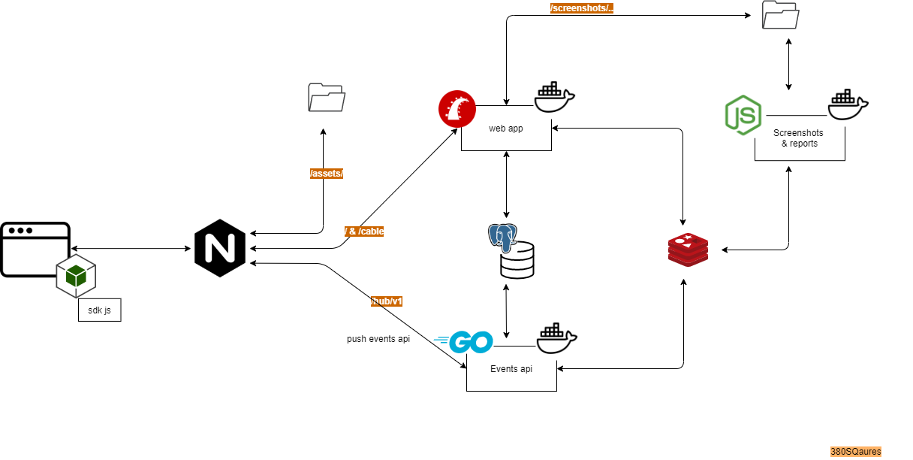
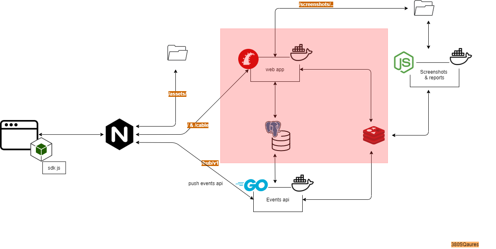

This is the web app module for [unknownanalytics](unknownanalytics.com/)
Simple analytics to protect user privacy and get only essentials metrics.

# Global architecture 



# Web app module  (current repo)




## Dependencies 

[Hub api](https://gitlab.com/unknown-inc/hub) : Hub collector, this is the module that collect clients events via an api 

[Screenshot & heatmap module](https://gitlab.com/unknown-inc/screenshot-heatmap-app/) : The app that generate screenshot and heatmaps

[Client SDK](https://gitlab.com/unknown-inc/web-sdk-client/-/blob/develop/src/utils.js) : The client js sdk

[Tools ans tests](https://gitlab.com/unknown-inc/tools/) : optional, this is a tool to test the api and other tips

## ecosystem 

* Ruby version

    - ruby-2.6.6 
    - Rails 6.0.2
    - pg

* Configuration

    `bundle install`

* Database creation

 Create your database 
 

* Database initialization

 run `(bundle exec ) db migrate` 

* Services (job queues, cache servers, search engines, etc.)

 > TODO 

### set up env variables

Below the list of env variables that should be set in order to run the app 

`UNK_ANA_DATABASE_URI=postgres://<user>:<pass>@<host>/<db_name>` // Postgres db uri 

`UNK_ANA_APP_NAME=<App name>` // will be displayed in title and emails
`UNK_ANA_DEFAULT_PAGE_TITLE=<your browser app title>` // will be displayed in title and emails
 
`UNK_ANA_STRIPE_API_KEY=<stripe_key>`  // this is not mandatory, you can keep it empty for now

`UNK_ANA_APP_HOST=<your_app_host>` // you host 

`UNK_ANA_REDIS_URI=redis://127.0.0.1:6379` // Redis uri

`UNK_ANA_REDIS_CHANNEL_PREFIX=channel_prefix` // Redis channel prefix. This is useful because when we use the same redis db for multiples purposes, we need to separate app channels from other channels.

`UNK_ANA_SMTP_URI=smtp://<user>:<pass>@host` // SMTP uri

`UNK_ANA_SMTP_AUTH_METHOD=<smtp_method>` // cram_md5 or plain ..	

`UNK_ANA_SCREENSHOT_SECRET_KEY=<your_secret>` // secret_12345_change_me	

`UNK_ANA_SECRET_KEY_BASE=<your_secret>` // A key to communicate the app with the [screenshot and heatmap](https://gitlab.com/unknown-inc/screenshot-app) module


### Deployment instructions on docker 

### Configure nginx

See ngnix folder to copy configuration files, for now, only staging and production are ready  


### Docker 

See Dockerfile for more details about internal components 
##### Build image
Note, that for building image we only need the minimum of env variables. 

``` 
 docker build \
  -t <you_image_name>  <path/to/web/app/.>  \
  --build-arg UNK_ANA_DATABASE_URI=postgres://<db_user:db_pass@127.0.0.1/db_name> \
  --build-arg RAILS_ENV=production  \
  --build-arg UNK_ANA_SMTP_URI=<smtp://smtp_uri> 
```

##### Run or create o container

```
docker run \
-p 3003:3000 \
--network=host
--env UNK_ANA_REDIS_URI=redis://127.0.0.1:6379 \
--env UNK_ANA_REDIS_CHANNEL_PREFIX=unknown_analytics_staging \
--env UNK_ANA_DATABASE_URI=postgres://<db_user:db_pass@127.0.0.1/db_name> \
--env UNK_ANA_APP_NAME="Unknown Analytics" \
--env UNK_ANA_STRIPE_API_KEY='<your_stripe_key>' \
--env UNK_ANA_APP_HOST=<your_app.host.com> \
--env UNK_ANA_DEFAULT_PAGE_TITLE="Unknown Analytics" \
--env RAILS_ENV=<your_env> \
--env UNK_ANA_SMTP_URI=<smtp_uri> \
--env UNK_ANA_SMTP_AUTH_METHOD=plain \
--env PORT=3000 \
--env UNK_ANA_CABLE_URL=<youdomain.com/cable/> \
--env UNK_ANA_SECRET_KEY_BASE=<your_secret_key_base> \ 
<you_image_name>:latest 
```

###  Usage of `--network="host"`

In order to access to database, redis and other services on host server, we need to run docker with `--network="host"`. It allows to get access to host outside docker.
**We don't rely on docker for database storage, so we use database server instead of docker images**

#### Docker on windows

Note that localhost address of docker on window is `redis://host.docker.internal`

#### Copy assets to nginx, 
Once the container is up and running, you should copy the latest generated assets from docker. In production/staging mode, rails does not serve static file.
It's always suitable to serve it using nginx or any other static, dedicated server
`docker cp $id_container:/var/www/unk-web-app/public/assets /var/www/unk-ana-assets_staging/assets` 

